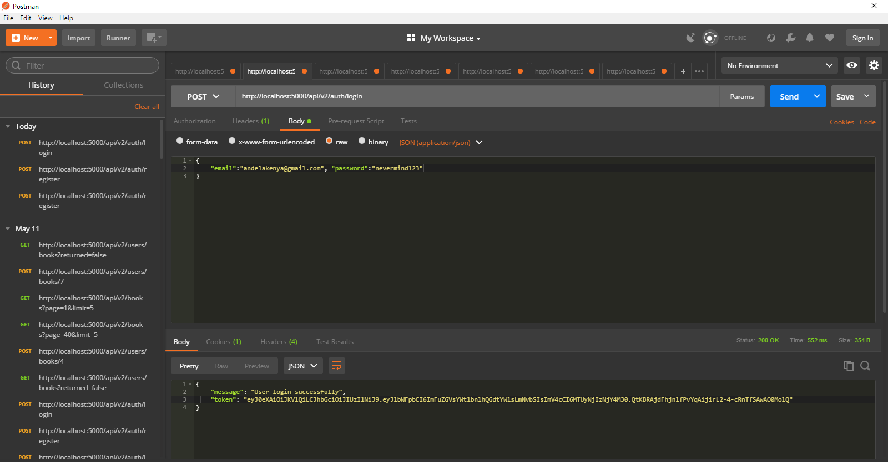

[](https://travis-ci.org/Michyjones/hello_books_API_DB)
[](https://coveralls.io/github/Michyjones/hello_books_API_DB)

# Hello_books_API_DB

Hello_Books API is an application that helps manage a library and its processes like stocking, 
tracking and renting books. With this application users are able to find and rent books. The 
application also has an admin section where the admin can do things like add books, delete 
books and modify book information.

## Installation and setup

Clone the repository
```
https://github.com/Michyjones/hello_books_API.DB.git
```

Go to the project root folder
```
cd hello_books_API_DB
```
Install the requirements
```
pip install -r requirement.txt
```

Run the program , Interact with API by sending HTTP requests in Postman
```
pyhton run.py
```
Initialize the Database
```
python manage.py db init
```
Migrate the Database
```
python manage.py db migrate
```
Upgrade the Database
```
python manage.py db upgrade
```

Create a postgres databases called books and tests using PgAdmin4.

Alternatively create the database from the command line :
```
createdb books
createdb tests
```
Create Super-User(Admin)
```
python admin.py  email  password
```

## Testing 
Run application by 
```
nosetests --with-covarage
```

 Interact with API by sending HTTP requests in Postman.

# API Endpoints

|  Endpoints                                             |Fuctionality                    | HTTP Method                   |
|  ------------------------------------------------------|--------------------------------|------------------------------ |
|  /api/v2/auth/register                                 |  Register/Create new user      |    POST                       |               
|  /api/v2/auth/login	                                 |  Logs in regestered user       |    POST                       | 
|  /api/V2/auth/reset-password                           |  Resets password               |    POST                       |   
|  /api/v2/auth/logout	                                 |  Logs out User                 |    POST                       |
|  /api/v2/books	                                     |  Add a Book                    |    POST                       |
|  /api/v2/books/<bookId>                                |  Modify book's information     |    PUT                        |
|  /api/v2/books/<bookId>                                |  Remove a book                 |    DELETE                     |
|  /api/v2/books                                         |  Retrieves all books           |    GET                        |
|  /api/v2/books/<bookId>                                |  Gets a single book            |    GET                        |
|  /api/v2/users/books/<bookId>                          |  Borrow a single book          |    POST                       |
|  /api/v2/users/books/<bookId>                          |  Return a single book          |    PUT                        |
|  /api/v2/users/books?returned=false                    | Retrieves all unreturned books |    GET                        |
|  /api/v2/users/books                                   | View Borrow history            |    GET                        |
                      

## Postman sample requests
Register User

Login User

Add Book

Borrow Book

Get Book with page limit

